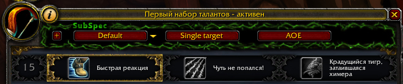

#SubSpec
It is the World Of Warcraft addon that allows to create a profiles of talents and switch between them by one button.

#Restrictions
Works only in WOW **6.2** version.   
Support user interfaces: standard, ElvUi.

#Installation
Just copy **SpellDamage** folder to **World of Warcraft\\Interface\\AddOns\\**.

#Note
The switching between profiles make interface freeze for a second.  
Unfortunately it is only one way to switch more then one talent.

#Screenshots

#Have a question?
Write - **demonist616@gmail.com**