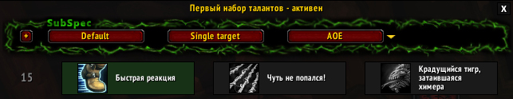

#SubSpec
It is the World Of Warcraft addon that allows to create a profiles of talents and switch between them by one button.

#Installation
Just copy **SubSpec** folder to **World of Warcraft\\Interface\\AddOns\\**.

#Note
Support user interfaces: standard, ElvUI.

#Slash commands
>**/subspec load \<profile name\>** - load the talents profile  
>**/subspec version** - display the addon version

#Screenshots

#Have a question?
Write - **demonist616@gmail.com**